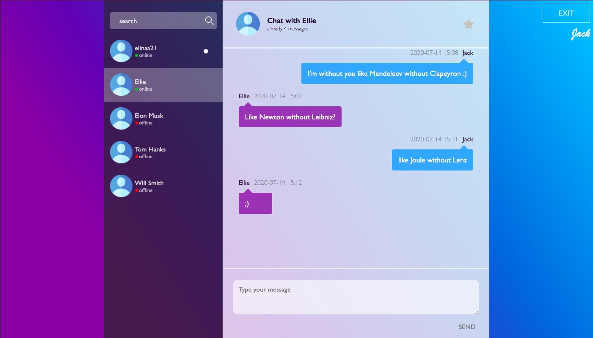

 # Messenger

## Technology stack
- React
- Redux
- SCSS
- Webpack
- Node.js
- Express.js
- MongoDB
- Socket.IO

## Oportunities
- Sending and receiving messages
- Authorization
- Registration
- Viewing online/offline statuses
- Viewing unread messages

## Future improvements
- Adding to favorites (button star)
- Сontact search

## Launch
1. install and launch mongoDB
2. create database 'test', create collections 'sessions' and 'dialogs'
3. npm i
4. npm run server
5. npm start
6. check localhost:8080
